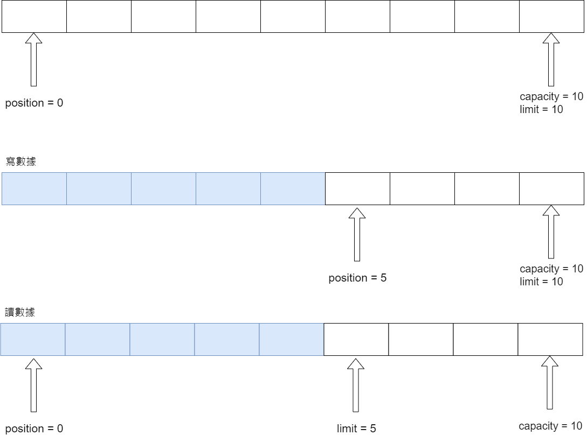
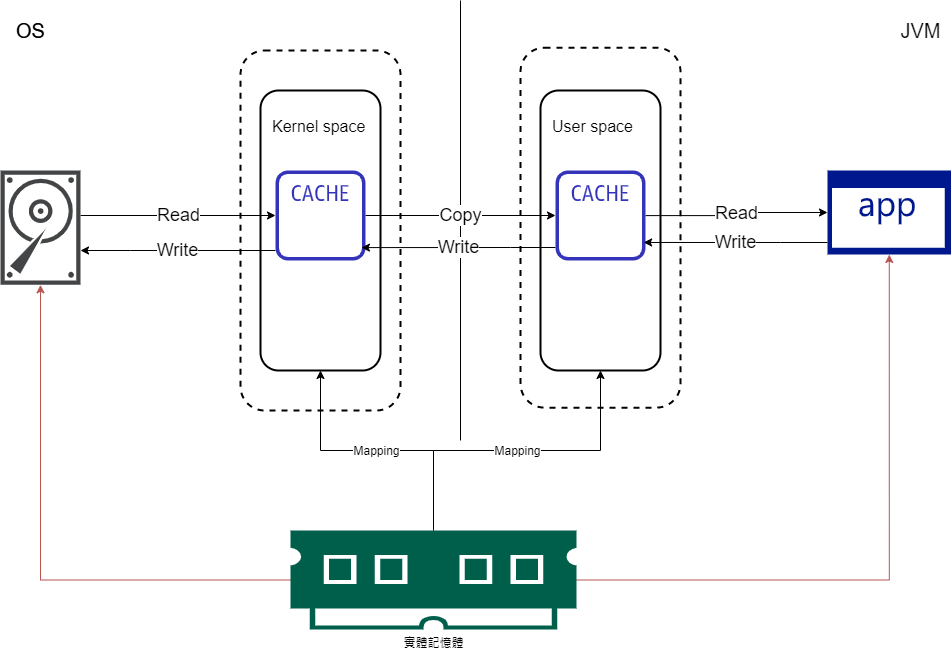

# NIO
## NIO 簡介
## NIO 與 IO 區別
|IO|NIO|
|---|---|
|Stream Oriented|Buffer Oriented|
|Blocking IO|Non Blocking IO（針對網路通訊）|
||Selectors|

以傳通IO來看


NIO 是面相緩衝區（雙向）的，到達目標後目標從緩衝區取出數據，並在一個通道中進行資料傳遞。通道傳輸數據，而緩衝區負責儲存數據。

對於 NIO 來說，通道（channel）、緩衝區（Buffer）是核心，前者表示打開到 IO 設備（檔案、網路）。當使用 NIO 時，需獲取連接 IO 設備的通道以及存放數據的緩衝區，之後才能進行數據操作。


## Buffer 和 Channel

### Buffer
Buffer 是一個用於特定基本數據類型的容器。由 `java.nio` 定義，其核心類是 `Buffer` 抽象類。而 Buffer 會與 NIO 中通道進行交互，*數據從通道讀入緩衝區，從緩衝區寫入通道中*。

根據數據類型不同（boolean）除外，提供了相對應的緩衝區
- ByteBuffer
- CharBuffer
- ShortBuffer
- IntBuffer
- LongBuffer
- FloatBuffer
- DoubleBuffer

上述都會透過 `allocate()` 獲取緩衝區。
主要會透過 `put()` 存入數據到緩衝區；`get()` 獲取緩衝區數據。然而要獲取數據必須先了解以下
- capacity
    - 容量，表示緩衝區最大存取數據的容量。*一旦宣告無法改變*
- limit
    - 界限，表示緩衝區中可以操作數據的大小，因此在 `limit` 位置後的數據將無法讀寫
- position
    - 位置，表示緩衝區正在操作數據的位置

0 <= mark <= position <= limit <= capacity 



[範例](src/main/java/com/example/day01/Test.java)

直接緩衝區與非直接緩衝區。非直接緩衝區透過 `allocate()` 方法分配緩衝區，將緩衝區建立於 JVM 中；直接緩衝區透過 `allocateDirect()` 方法分配緩衝區，將緩衝區建立於實體記憶體中，可提高效率。

```java
ByteBuffer byteBuffer = ByteBuffer.allocateDirect(1024);
byteBuffer.isDirect(); // 是否在物理記憶體中
```



### Channel

由 `java.nio.channels` 定義。`channel` 表示 IO 源與目標*打開連接*。類似於一般 IO 中的 stream(流)，但在 channel 中不能直接讀取數據，需要與 Buffer 進行交互。

- FeilChannel
- SocketChannel
- ServerSocketChannel
- DatagramChannel

使用 `getChannel()`、`open()`或是 `File` 類的 `newByteChannel()` 獲取 channel。對於本地 IO `FileInputStream/FileOutputStream`、`RandomAccessFile`；網路 IO  `Socket`、`ServerSocket`、`DatagramSocket`。

[範例- FileChannel](src/main/java/com/example/day02/TestChannelFileCopy.java)
[範例-實體記憶體](src/main/java/com/example/day02/TestChannelFileCopyIsDirect.java)

channel 之間的數據傳輸使用 `transferFrom()`、`transferTo()`
[範例](src/main/java/com/example/day02/TestChannelTransfer.java)


##### 分散(Scatter)與聚集(Gather)
分散讀取，將通道中的數據分散到多個緩衝區。會按照緩衝區順序，從 channel 中讀取數據依次將 Buffer 填滿
聚集寫入，將多個緩衝區的數據聚集到通道
[範例](src/main/java/com/example/day02/TestChannelScatterAndGather.java)

##### Charset
編碼，字串到字節數組，解碼則反之。
[範例](src/main/java/com/example/day02/TestCharSet.java)


## NIO 非主塞式網路通訊
使用 NIO 完成網路通訊的三個核心是 `Channel`、`Buffer`、`Selector`。`Selector` 多路復用器，用於監控 SelectableChannel 的 IO 狀況。

`java.nio.channels.Channel` Interface：
    ｜--SelectableChannel
        |--SocketChannel
        |--ServerSocketChannel
        |--DatagramChannel
        ...
        |--Pipe.SinkChannel
        |--Pipe.SourceChannel
## Pipe
是兩個執行續之間的單向數據連接。Pipe 有一個 Source 通道和一個 Sink 通道。數據會被寫到 Sink 通道，從 source 通道讀取。

## NIO2
- Path
- Paths
- Files


# IO
## File
- File 物件代表一個檔案或資料夾
- delete 方法，該目錄下不能有檔案或子目錄
## IO 原理及流的分類 
- IO 處理設備之間的傳輸
- Java 是以 `stream` 的方式進行數據的交互

I 表示 Input，從 Disk、DVD 等儲存設備讀取資料到記憶體，O 表示 Output 從記憶體讀資料至 Disk 等儲存設備

### stream 分類
- 數據單位不同
    - 8 bit 
        - 字節流
            - 非文本數據
            - 圖片
            - 影像
    - 16 bit
        - 字符流
            - 文本
- stream 方向
    - input
    - output
- stream 的角色
    - 節點 stream
    - 處理 stream

||字節流|字符流|
|---|---|---|
|input|InputStream|Reader|
|output|OutputStream|Writer|


## 檔案流
### 從硬碟讀數據
- FileReader 
    - read()
        - 每次讀入一行，檔案到結尾時傳 -1
    - read(char cbuf)
        - 返回每次讀入 cubf 陣列中的字符個數，如果在檔案末尾返回 -1
- FileInputStream
### 從記憶體讀數據
- 輸出的檔案可以不存在，會自動創建
- 當使用 `FileWriter` 可針對 append 參數設定，是否覆蓋檔案
- FileWriter 
    - write()
    - write(cbuf, off, len)
        - 每次寫出 len 個字符
- FileOutputStream

## 緩衝流
- 提供流的讀取、寫入的速度
    - 內部提供緩衝區
- 當 buffer 來封裝 Stream 的方法時，關閉 Buffer 資源時，Stream 資源也會被關閉
- 處裡流，套接在自己流基礎上
### 方法
- BufferedInputStream
- BufferedOutputStream
    - write()
        - 內部會自動 `flush()` 緩衝區
- BufferedReader
    - read()
    - readLine()
        - 不包含換行
        - 可接 `newLine()`
- BufferedWriter

## 轉換流
字節流和字符流之間的轉換，字節 -> 字符 -> 字節
- InputStreamReader
    - 字節轉換字符
- OutputStreamWriter
    - 字符轉換字節
## 標準輸入、輸出流 
- System.in 系統標準輸入
    - 類型 `InputStream`
    - 實現 System.in -> `轉換流` -> `BufferedReader` 的 `readLine()`
- System.out 系統標準輸出
    - 類型 `PrintStream`
## 打印流
將基本數據類型的數據格式轉化為字串輸出，不拋出異常、有自動 `flush` 功能，寫入字符非字節下，應使用 `PrintWriter` 類
- PrintStream
- PrintWriter

## 數據流
方便操作基本數據類型和 String 的數據，可使用數據流
- DataInputStream
- DataOutputStream
    - 讀取順序要與檔案中順序一至
    - 每調用 write 相關方法，要利用 `flush()` 將記憶體中的數據寫入檔案
- 上述分套接在 `InpuStream` 和 `OutputStream`
## 對象流 
用於儲存和讀取*基本數據類型*或對象的處裡流。可以把 Java 中的物件寫入至數據源中，也能還原。
- ObjectInputStream
    - 反序列化
    - 讀取
- ObjectOutputStream
    - 序列化
    - 保存
- 兩者不能序列化 `static` 和 `transient`
    - transient 表示不序列化該屬性

### 物件的序列化
允許把記憶體中的物件轉換平台無關的二進制流，從而允許把該流保存至硬碟上，或通過網路將該流傳輸至另一節點。

一個物件要可序列化，須滿足以下需求
- 要實現 `Serializable` 或 `Externalizable` 之一
    - Serializable 一個標示接口
- 要提供 serialVersionUID 的靜態常量
    - 用來實現不同版本間的兼容性。其目的是以序列化物件進行版本控制，有關各版本反序列化是否兼容
    - 當 class 無定義該 UID 則 class 在變化時，反序列化會出錯
- 須保證每個屬性都能序列化
## 隨機存取文件流 RandomAccessFile
支持隨機存取，可直接跳到檔案任一位置來讀、寫檔案
- RandomAccessFile 類可實現輸入輸出流
    - 做輸出流時會對檔案內容進行覆蓋
    - `seek()` 將指定位置
## NIO.2 中 Path、Paths、File 類使用
- NIO 是基於 buffer，IO 是基於 stream
- NIO 更高效率，有針對輸入輸出 NIO 和針對網路編碼 NIO
- Path 可用來取代 File，更加靈活